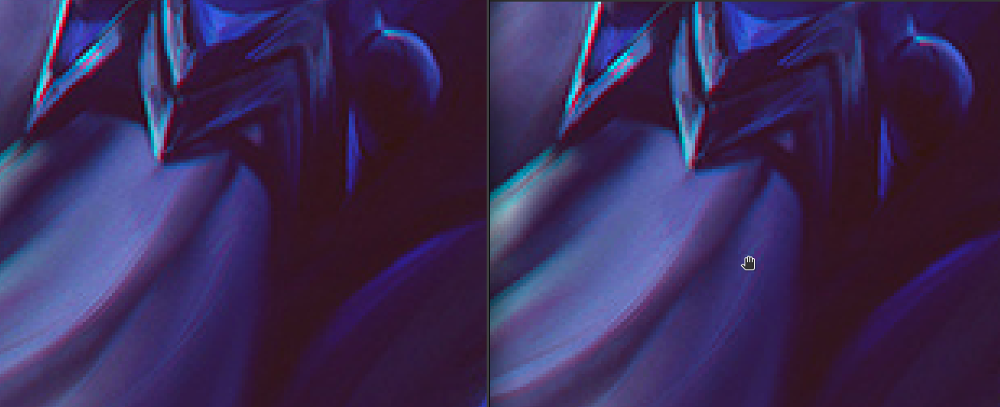
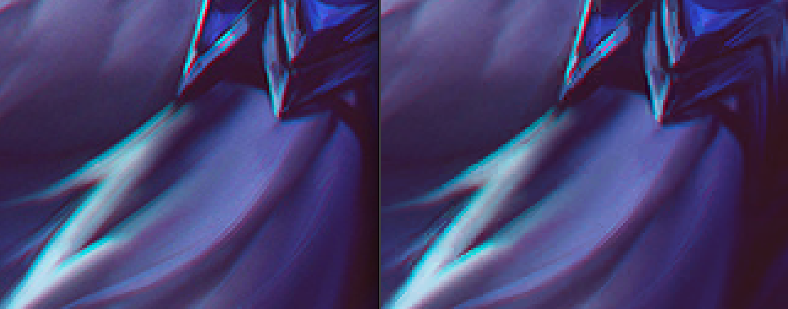
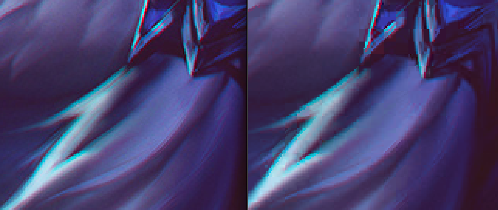
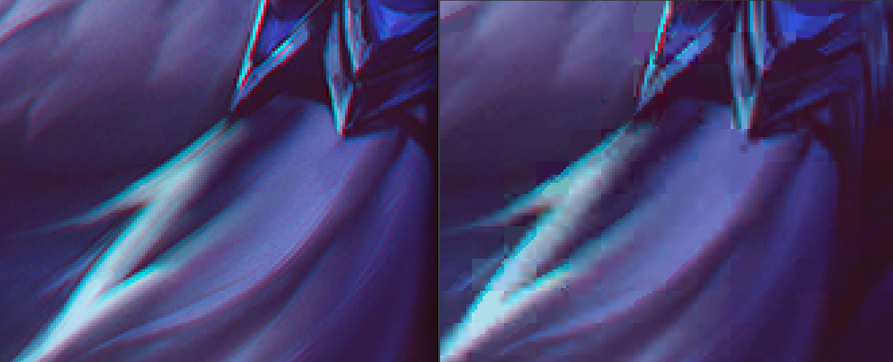
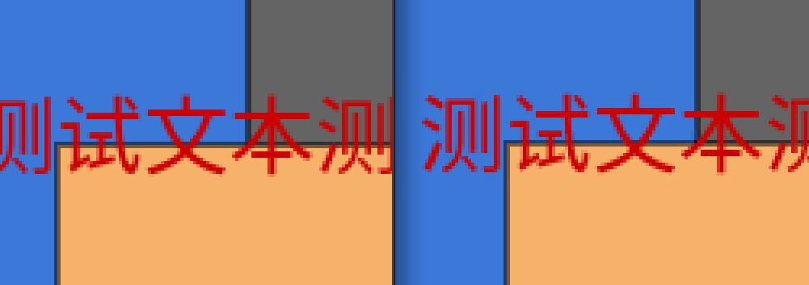
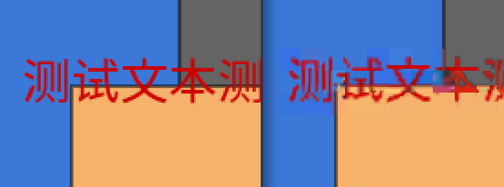

- 检测字段
    - GL_KHR_texture_compression_astc_ldr
        - ldr 低动态范围 
    - GL_KHR_texture_compression_astc_hdr
        - hdr 高动态范围

- 标记
    - GL_COMPRESSED_色彩空间_ASTC_块大小_KHR
        - 其中色彩空间可以有：
            - RGBA
            - SRGB8_ALPHA8
        - 块大小可以为:
            - 4x4 
            - 5x4 5x5
            - 6x5 6x6
            - 8x5 8x6 8x8
            - 10x5 10x6 10x8 10x10
            - 12x10 12x12
        - 比如
            - GL_COMPRESSED_RGBA_ASTC_4x4_KHR
            - GL_COMPRESSED_SRGB8_ALPHA8_ASTC_5x4_KHR

- astcenc
    - 压缩
        - astcenc -cl input.png output.astc 4x4 -thorough
    - 解压
        - astcenc -dl input.astc output.png
    - 关于astcenc，这个软件github上下载的有四个版本，这个主要是针对指令集做了调整，生成速度会有提升，SSE2构建可在所有x86-64主机上运行，​​但它是三个中最慢的。另外两个需要扩展的CPU指令集支持。因为float计算导致生成的结果可能会有非常细微的差距
        - astcenc-sse2 -使用SSE2
        - astcenc-sse4.1 -使用SSE4.1和POPCNT
        - astcenc-sse4.2 -使用SSE4.2和POPCNT（已弃用）
        - astcenc-avx2 -使用SSE4.2，POPCNT和AVX2

- 简要 
    - ASTC中ARM研发的一种较新的贴图压缩格式，从IOS9(A8架构，现在都iOS12了)开始支持ASTC压缩格式 ，相对于PVRTC2/4而言，ASTC(4X4)的压缩比会增加到0.25，不过显示效果也会好很多，而且不要求图片长宽相等且为2的幂次方。而且Android设备也支持。
    - 图片压缩核心思想是将大图分为多个颜色块，**每个颜色块固定大小为16-bytes**
    - ASTC目前尚未广泛使用。它可以作为OpenGL扩展使用，但它不是OpenGL的核心功能。ASTC扩展是针对OpenGL ES 3.0而非台式机OpenGL编写的。这意味着相对于桌面GL，其某些功能受到限制。

- 关于ASTC
    - 每个块取两个端点色，其他的颜色都是通过插值+权重平均的方式计算出来的，其中端点的取色和权重算法有多个方案，每个块用的算法可能都不一致
    - 关于通道，压缩器也会自动的为每个块选择最优的方案，比如某些块alpha通道是0,那么就只保存了alpha通道为0,其他alpha通道为1的块也只保存rgb三个通道，rgba都有特殊数据时才四通道，相比之下，在其他压缩纹理格式下，可能会用大量空间保存一堆重复的通道信息。
    ```
        单通道（类似于仅红色的RGTC）。
        两个通道，相互关联。
        两个通道，不相关（类似于红色/绿色RGTC）。
        三个通道都相关（类似于DXT1）。
        三个渠道，第三个渠道与前两个渠道不相关。
        四个通道都相关。
        四个通道，第四个与前三个不相关（类似于DXT3 / 5）。
    ```
    - ASTC图像格式有许多变量。但是，几乎所有这些变量都是按块指定的，而不是针对整个图像。比如上面说的通道数也是每个块的属性。因此，单个ASTC图像都可以使一个块仅使用1个通道，而另一个块使用3通道。
    - 使用ASTC，所有ASTC图像格式都提供相同数量的通道：RGBA。
    
- 压缩率公式
    - 像素大小 = 16-bytes / 分块宽高 * 8-bit；
    - 压缩率 = 原始像素大小（32-bit） / 像素块大小；
    - 图像大小 = 原始图片大小 / 压缩率；

- 压缩率参考表
    |块宽高 | 像素大小 | 压缩率 |
    |:---:|:---:|:---:|
    |4x4	|8.00| 4 |
    |5x4	|6.40| 5 |
    |5x5	|5.12| 6.25 |
    |6x5	|4.27| 7.49 |
    |6x6	|3.56| 8.99 |
    |8x5	|3.20| 10 |
    |8x6	|2.67| 11.99 |
    |8x8	|2.00| 16 |
    |10x5	|2.56| 12.5 |
    |10x6	|2.13| 15.02 |
    |10x8	|1.60| 20 |
    |10x10	|1.28| 25 |
    |12x10	|1.07| 29.91 |
    |12x12	|0.89| 35.95 |

- 假设一张4MB的1024*1024原始图片：
    |块宽高|像素大小(bits)|压缩率|压缩后图片大小|
    |:---:|:---:|:---:|:---:|
    |4*4 |8	|4	|1MB|
    |5*5 |5.12|	6.25|	655KB|
    |8*8 |2	|16|	256KB|
    |10*10|	1.28|	25|	163KB|
    |12*12|	0.89|	35.95|	113.93KB|


- 关于效果（先把一张图转为astc格式，再转回原图格式对比）
    - 测试1 (1920x1080尺寸标准  被常规压缩过的png图  大小2.8M)
        - 4x4(2.0M)
            - 转换时间：22.7s
            - 细节对比(缩放400% 左侧原图 右侧压缩后)
            
        - 6x6(904k)
            - 转换时间：38.2s
            - 细节对比
            
        - 8x8(508k)
            - 转换时间: 18.3s
            - 细节对比
            
        - 12x12(228k)
            - 转换时间: 9.4s
            - 细节对比
            
    - 测试2 (486x317尺寸不标准 色彩单一 alpha通道右上区域 大小16k)
        - 忽视右侧边缘黑色渐变，那个是看图软件窗口边缘自动加的
        - 4x4(156k 486x317)
            - 转换时间:0.1s
            - 细节对比
            
        - 12x12(20k)
            - 转换时间:0.3s
            - 细节对比
            

    
- 结论：
    - astc格式是有损压缩格式，把图像分为指定大小的块，无论块尺寸多大必定只占用16字节
    - 压缩原理大致是在块中选出两个端点色，然后做插值后加权平均后得到的块内其他颜色，有多种算法
    - 块和块之间相对独立，同一张astc图中每个块可能用的算法都不同，储存的通道数也不同，但块的尺寸只要定下则每个块的大小都是一致的，且输出的通道也必定是rgba四通道齐全
    - 压缩时间和图像颜色复杂度，块尺寸有关，图像越复杂块越小速度越慢
    - 测试中的图除了12x12其他的实际上以我非美工的普通人看来没啥明显差异，除非放大一定倍数，比如测试对比中放大4倍，如果使用的话我感觉8x8是比较好的，无论是效果转换速度还是尺寸上都还好


- https://arm-software.github.io/opengl-es-sdk-for-android/structastc__header.html
- https://github.com/ARM-software/astc-encoder
- https://www.khronos.org/opengl/wiki/ASTC_Texture_Compression
- https://www.khronos.org/registry/OpenGL/extensions/KHR/KHR_texture_compression_astc_hdr.txt